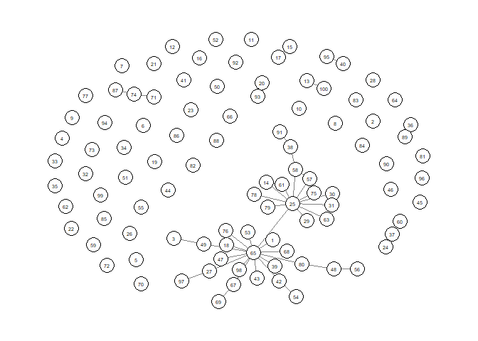

<!-- README.md is generated from README.Rmd. Please edit that file -->

# Hierarchical Matrix-F prior for Gaussian Graphical Models, or HMFGraph

<!-- badges: start -->
<!-- badges: end -->

HMFGraph implements Bayesian Gaussian Graphical Model using hierarchical
matrix-F prior. A generalized expectation-maximization algorithm (GEM)
and a Gibbs sampler are included.

## Installation

You can install the package using the following commands:

``` r
# install.packages("devtools")
devtools::install_github("AapoKorhonen/HMFGraph")
```

## Example 1: Using optimal CI for edge selection

This is the recommended way to use this method. Using the function
HMFGraph, the method is simple to run.

``` r
library(HMFGraph)

n <- 200
p <- 100

set.seed(42)
generated_data <- data_generator(n=n, p = p)

results <- HMFGraph(generated_data$data, parallel = T)

library(qgraph)

qgraph(results$adjacency_matrix)
```


The function HMFGraph is a wrapper of three different function. If
prefered, the user can run the function individually. The HMFGraph_GEM
function selects an optimal alpha value based on a condition number
constraint method (if the alpha is not specified in the function call)
and uses the GEM algorithm to obtain a MAP estimate.
HMFGraph_GEM_permutations calculates the null network (or null
distribution) with permutations and HMFGraph_GEM_optimal_CI selects the
optimal credible interval (CI) based on the permutations.

``` r
library(HMFGraph)

n <- 200
p <- 100

set.seed(42)
generated_data <- data_generator(n=n, p = p)

results_HMFGraph_GEM <- HMFGraph_GEM(generated_data$data, beta=0.9)

permutations <- HMFGraph_GEM_permutations(generated_data$data, results_HMFGraph_GEM, number_of_permutations = 50, parallel = T)

results_optimal_CI <- HMFGraph_GEM_optimal_CI(results_HMFGraph_GEM, permutations, expected_connections = p)

library(qgraph)

qgraph(results_optimal_CI$adjacency_matrix)
```


## Example 2: Using FDR-control for edge selection

``` r
library(HMFGraph)

n <- 200
p <- 100

set.seed(42)
generated_data <- data_generator(n=n, p = p)

results_HMFGraph_GEM <- HMFGraph_GEM(generated_data$data, beta=0.9)

permutations <- HMFGraph_GEM_permutations(generated_data$data, results_HMFGraph_GEM, number_of_permutations = 50, parallel = T)

results_FDR <- HMFGraph_GEM_FDR_control(results_HMFGraph_GEM, permutations, target_FDR = 0.2)

library(qgraph)

qgraph(results_FDR$adjacency_matrix)
```



## Example 3: Using CI for edge selection

``` r
library(HMFGraph)

n <- 200
p <- 100

set.seed(42)
generated_data <- data_generator(n=n, p = p)

results_HMFGraph_GEM <- HMFGraph_GEM(generated_data$data, beta=0.9)

results_CI <- HMFGraph_GEM_CI(results_HMFGraph_GEM, CI = 0.9)

library(qgraph)

qgraph(results_CI$adjacency_matrix)
```


## Example 4: Using Gibbs sampler with CI for edge selection

``` r
library(HMFGraph)

n <- 200
p <- 100

set.seed(42)
generated_data <- data_generator(n=n, p = p)

alpha <- alpha_binary_search(generated_data$data)

results_HMFGraph_gibbs <- HMFGraph_gibbs_sampler(generated_data$data, alpha = alpha, beta=0.9, iters = 5000, burn_in = 1000)

results_gibbs_CI <- HMFGraph_gibbs_CI(results_HMFGraph_gibbs, CI = 0.9)

library(qgraph)

qgraph(results_gibbs_CI$adjacency_matrix)
```


